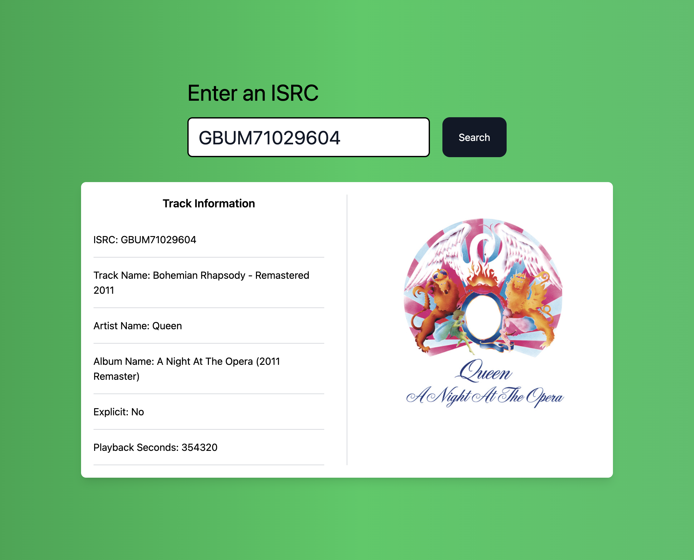
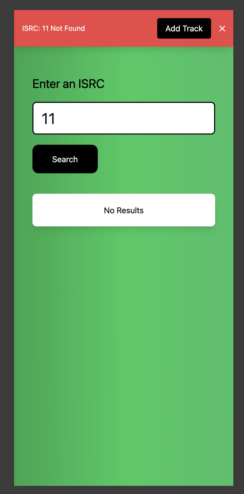
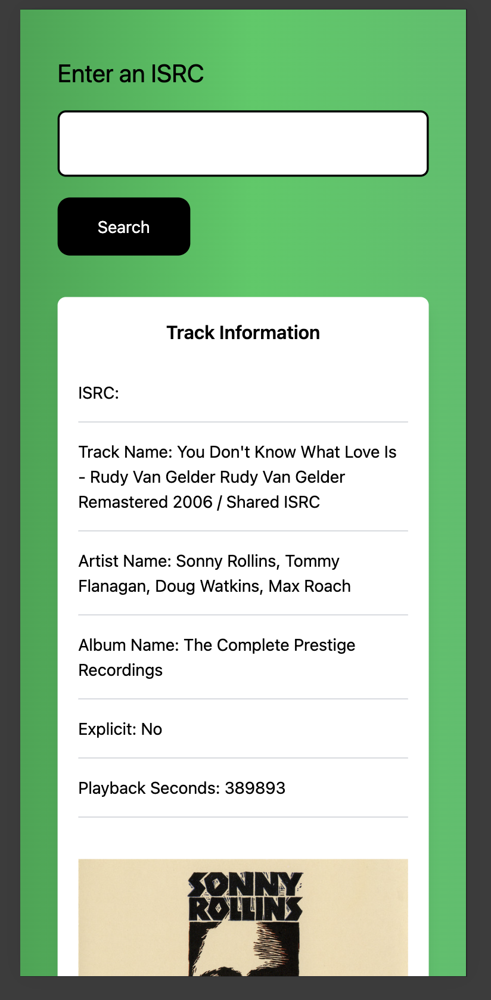

# Spotify UI

This is an interface to create and search for ISRCs using a service that connects to the spotify API.


## Requirements

- Node 20.11.1
- React 18.2
- TailwindCSS 3.4
- Zustand 5.0.3


## Run

To run the project:

```bash
  1 - npm install
  2 - npm run dev
```

The UI is quite simple, we have only one input field that receives the ISRC.

When an ISRC is found, it will load the information in the section below, both the track information and the cover image.




If the ISRC was not found, the application handles the error with a message at the top, it also gives the option to create the track if necessary by searching for it with the spotify API in the backend.


the application is fully responsive for other screen sizes.






